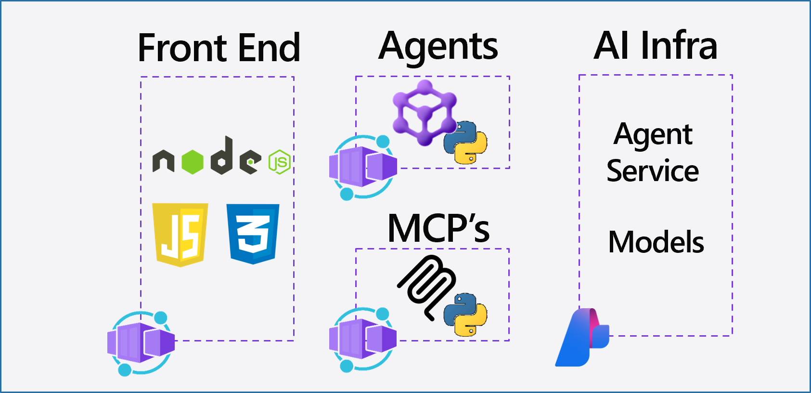

## Agricultural Drone Controller

An intelligent drone management system that coordinates autonomous agricultural drones for crop monitoring, precision spraying, and yield optimization across large farming operations.

